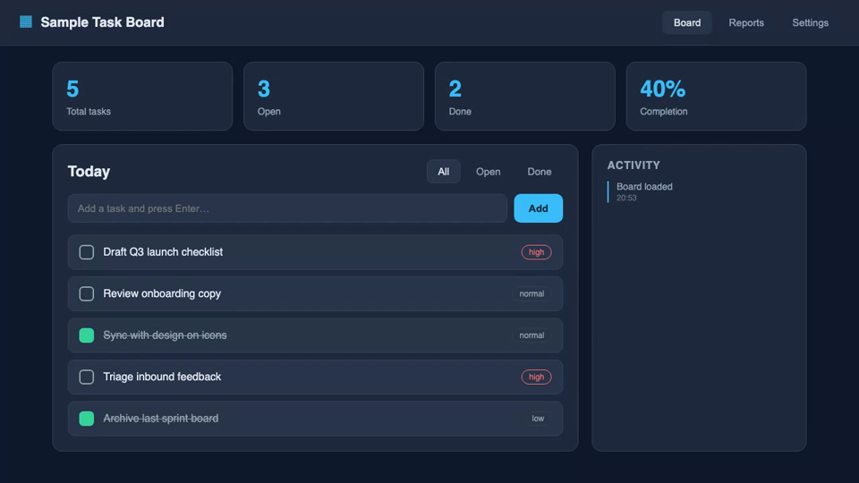

# demo-video-pipeline — narrated product demos, generated by a Kiro CLI agent

Generate a complete **narrated demo video** of a web app: record the UI, synthesize a
voiceover, and stitch them into a synced MP4. The repo ships a **Kiro CLI skill**, so the
primary way to use it is conversational — open the repo, start `kiro-cli chat`, and ask
the agent to generate the demo video. The agent orchestrates the deterministic Python
pipeline under the hood (recording, TTS, stitching).

It comes with a **neutral sample app**, a **hand-written sample script**, and a **script
generator**, so you get an end-to-end result with none of your own input — then swap in
your own app and narration.

```
narration script ──▶ TTS (3 backends) ──▶ record the app ──▶ stitch ──▶ demo.mp4
```

Three voiceover backends, pick by barrier-to-entry:

| # | Backend | What it needs | When |
|---|---------|---------------|------|
| 1 | **Amazon Polly** (default) | AWS creds only (an API call) | Lowest barrier — start here |
| 2 | **Qwen3-TTS speaker** | An Amazon SageMaker endpoint you deploy | Open-weights voice you control |
| 3 | **Qwen3-TTS voice clone** | Endpoint + your own ~10s reference clip | Narrate in your own voice |

> All sample data in this folder is **fictional** — no real companies, people, or numbers.
> The sample app has no branding.

## Demo videos

Two narrated demos produced by this pipeline from the bundled sample app:

- **Amazon Polly (default):** <https://schristoph.online/media/demo-video-pipeline-polly.mp4>
- **Qwen3-TTS named speaker (Amazon SageMaker):** <https://schristoph.online/media/demo-video-pipeline-qwen.mp4>

```html
<video controls width="720" src="https://schristoph.online/media/demo-video-pipeline-polly.mp4"></video>
<video controls width="720" src="https://schristoph.online/media/demo-video-pipeline-qwen.mp4"></video>
```

## The sample app

The recorder drives a neutral **Sample Task Board** single-page app (`sample-app/`) — a
simple, no-branding task tracker with **entirely fictional data**:

- **Summary stats** — total tasks, open, done, and a completion percentage.
- **Task list** — "Today" view with check-off toggles.
- **Add-task input** — type a task and press Enter (the recorder types into it live).
- **Filters** — All / Open / Done.
- **Activity feed** — a running side panel of recent actions.

Every interactive element carries a stable `data-testid` so the Playwright recorder can
drive it deterministically. It's intentionally generic so the demo showcases the *pipeline*,
not any particular product.



## Prerequisites

- **Install Kiro CLI** — the primary entrypoint is a conversational skill. Follow the
  official docs: <https://kiro.dev/docs/cli/installation/>.
- **Python 3.10+** and **ffmpeg** on PATH (`brew install ffmpeg` — provides `ffprobe` too).
  The agent builds an isolated `./.venv` for you on first run.
- **AWS credentials** on the standard chain (profile / role / SSO). Amazon Polly needs
  `polly:SynthesizeSpeech`; the Amazon SageMaker options need SageMaker + Amazon S3
  permissions; the voice-clone transcription step needs Amazon Transcribe + Amazon S3.

## Use it with Kiro CLI

The repo ships a self-contained Kiro agent (`.kiro/agents/demo-video-pipeline.json`) and a
skill (`.kiro/skills/demo-video/SKILL.md`). No external configuration is required.

```bash
cd demo-video-pipeline
kiro-cli chat --agent demo-video-pipeline
```

Then just ask, in plain language. One prompt per backend:

### Option 1 — Amazon Polly (default)

> *"Generate a narrated demo video of the sample app."*

The agent runs `make setup` (creates `./.venv`, installs deps, installs the Chromium
recorder), synthesizes the narration with Amazon Polly, records the sample app holding each
scene for its narration length, stitches the audio back-to-back, and writes
`media/demo.mp4`. No deployment, lowest barrier. Follow up to change the voice:

> *"Use the Joanna voice instead."*

### Option 2 — Qwen3-TTS named speaker (Amazon SageMaker)

> *"Now let's use the Qwen model for the voice."*

An open-weights voice served from an asynchronous, **scale-to-zero** Amazon SageMaker
endpoint.

> ⚠️ **First use deploys the endpoint.** The first build takes **~15–25 min** (cold start;
> both 1.7B models load) and runs on a GPU instance (`ml.g5.xlarge` ≈ **$1.41/hr** while
> processing). The agent warns you before deploying. **After that the endpoint is reused** —
> it scales to zero (~$0 while idle), so later renders just wake it (0→1) rather than
> redeploying.

### Option 3 — Qwen3-TTS voice clone (Amazon SageMaker)

> *"Let's clone my voice and re-record the video in my voice."*

The agent walks you through: record a ~10–30s reference clip
(`bash scripts/record_reference.sh`, or a clip you make in QuickTime Player) →
transcribe it to its exact words with Amazon Transcribe
(`scripts/transcribe_reference.py`) → confirm the transcript → render with
`make demo-clone`. It **reuses the endpoint** from Option 2 (deploy once, never tears down
between renders). This repo ships no cloned audio — you supply your own clip.

> *"Now make a script from my own app in ./my-app and render that."* — works in any backend.

See [`.kiro/skills/demo-video/SKILL.md`](.kiro/skills/demo-video/SKILL.md) for the full
workflow the agent follows.

## Tearing down the Amazon SageMaker endpoint

The Qwen backends run on a **scale-to-zero** endpoint that costs **≈ $0 while idle**, so you
**deploy it once and reuse it** across renders — the agent will **not** tear it down
automatically. When *you* are completely finished with voice work and want to stop any
SageMaker billing, delete it explicitly:

```bash
make teardown        # = bash sagemaker/teardown.sh
```

This deletes the **endpoint, endpoint config, and model**. It **leaves the Amazon S3 bucket
and IAM role intact** (delete those manually if you want a full cleanup). Tearing down is
user-driven — there is no automatic teardown after a render.

---

## Advanced / manual (raw `make`)

The Kiro skill is a thin orchestration layer over a plain Python + Makefile pipeline. You
can drive every step yourself without the agent.

```bash
make setup             # creates ./.venv, installs deps, runs `playwright install chromium`
cp .env.example .env   # optional: pick a voice, region, backend
```

> **Run `make setup` first.** It builds `./.venv`; every other `make` target runs through
> `./.venv/bin/python` automatically, so you never need to activate the venv. Managing your
> own environment instead? Override the interpreter, e.g. `make demo PY=python3` (the deps
> in `requirements.txt` must already be importable). Edits to `.env` are picked up
> automatically by every target.

### Option 1 — Amazon Polly (default, no deployment)

The fastest path. No GPUs, no endpoints — just the managed `synthesize-speech` API.

```bash
make demo
# = .venv/bin/python pipeline/render.py --backend polly \
#       --script sample-content/narration.json --out media/demo.mp4
```

This synthesizes the seven sample segments with Amazon Polly (Matthew, neural), records the
sample app holding each scene for exactly its narration length, and lays the audio
back-to-back. Output: `media/demo.mp4`. Pick another voice with `POLLY_VOICE` in `.env`
(`Joanna`, `Stephen`, `Ruth`, …).

### Option 2 — Qwen3-TTS named speaker (Amazon SageMaker)

Deploy the open-weights **[Qwen3-TTS](https://github.com/QwenLM/Qwen3-TTS)** model
(Apache-2.0) as an **asynchronous, scale-to-zero** Amazon SageMaker endpoint, then narrate
with a named English speaker (e.g. "Aiden") and an instruct style string.

> ⚠️ **Deploy-time cost + wait.** The first build is **~15–25 min** (cold start; both 1.7B
> models load) on a GPU instance (`ml.g5.xlarge` ≈ **$1.41/hr** while processing).

```bash
make deploy       # FIRST TIME ONLY: quota precheck → role/bucket → Model + async EndpointConfig + Endpoint
make status       # poll until InService (first build ~15–25 min)
make autoscale    # register min=0 (scale to zero → $0 compute when idle)
make validate     # smoke-test the speaker
make demo-qwen    # render with the Aiden voice
```

**Deploy once, then reuse.** The endpoint is **scale-to-zero**: autoscaling **min=0** means
**$0 when idle**, billed per-second `ml.g5.xlarge` ≈ **$1.41/hr** **only while processing**
(a full render costs cents). Do **not** tear it down between renders — for a later render,
check `make status` and reuse the existing endpoint, waking it (0→1) if it idled to zero.
Tear down only when completely finished (see "Tearing down" above) — `make teardown`.

> **Scale-from-zero gotcha.** `make autoscale` registers a target-tracking policy on
> backlog-per-instance, which scales **1→N** but not **0→1**. After the endpoint has been
> idle at zero instances, the first invoke can sit in the backlog without waking an
> instance. To wake it deterministically, either set the desired count to 1 once
> (`aws sagemaker update-endpoint-weights-and-capacities --endpoint-name "$ENDPOINT_NAME"
> --desired-weights-and-capacities '[{"VariantName":"AllTraffic","DesiredInstanceCount":1}]'`),
> or add a step-scaling policy on the `HasBacklogWithoutCapacity` metric. First
> InService after a cold start is ~8–15 min (both 1.7B models load).

### Option 3 — Qwen3-TTS voice clone (Amazon SageMaker)

Same endpoint, `voice_clone` mode: clone a voice from a short reference clip. **You supply
your own clip** — this repo ships no cloned audio. Reuses the Option-2 endpoint (deploy
once; no redeploy or teardown around the clone).

```bash
# 1. Record ~10–30s of clear speech → ref_audio.wav (or make one in QuickTime Player)
bash scripts/record_reference.sh
# 2. Transcribe it to its EXACT words → ref_text.txt (Amazon Transcribe)
.venv/bin/python scripts/transcribe_reference.py --audio ref_audio.wav --out ref_text.txt
# 3. Confirm the transcript, then render (reuses the deployed endpoint)
make demo-clone REF_AUDIO=ref_audio.wav REF_TEXT="$(cat ref_text.txt)"
```

> **In-context cloning needs the true transcript.** Pass the reference clip's *actual*
> words as `REF_TEXT`. A wrong/placeholder transcript makes generation run long and the
> async call time out. `scripts/transcribe_reference.py` produces the exact transcript for
> you (upload → Amazon Transcribe job → plain text).

### Make a script for your own content

The generator extracts facts from a **web app's source** *or* a **product spec** and
proposes a narration script (and a ready-to-paste LLM prompt):

```bash
# From the sample app (or any dir with an index.html using data-testid hooks):
make script-from-app          # → /tmp/draft.json + /tmp/prompt.txt
# From a product spec:
make script-from-spec SPEC=my-product.md
# Optionally let Amazon Bedrock write the polished script from the prompt:
python scripts/generate_script.py --app sample-app --bedrock --out /tmp/script.json
```

Review and tighten the wording, then render it:
`python pipeline/render.py --backend polly --script /tmp/script.json --out media/mine.mp4`.

## How it stays in sync

The sample app has predictable latency, so the pipeline uses the **fixed-pause** method:
the recorder holds each segment on screen for exactly its measured audio length, so the
narration is laid **back-to-back** with a single lead-in offset and can't drift.

For **re-voicing an existing capture** or apps with **variable latency** (live backends,
network), use the **re-time** method instead — it cuts the capture into one scene per
segment at known boundaries and sets each scene to its narration length (freeze-pad if the
narration is longer, trim the trailing hold if shorter):

```bash
python pipeline/render.py --method retime --video media/capture.mp4 --marks marks.json \
    --backend polly --out media/revoiced.mp4
```

`marks.json` is a list of scene-boundary timestamps (one more than the number of
segments). Derive them from ffmpeg scene detection, on-screen timestamps, and frame
inspection.

## Layout

```
.kiro/
  agents/demo-video-pipeline.json  self-contained Kiro CLI agent (basic tools + skill discovery)
  skills/demo-video/SKILL.md       the conversational workflow the agent follows
sample-app/            neutral, no-branding sample SPA the recorder drives (data-testid hooks)
sample-content/
  narration.json       the hand-made sample narration script
docs/
  speaker-notes.md     human-readable companion to the script
  sample-app.png       a still of the sample app
pipeline/
  script_model.py      load/validate a narration script
  tts.py               TTS abstraction: polly | qwen-speaker | qwen-clone
  record.py            Playwright recorder (fixed-pause: each scene = its audio length)
  stitch.py            lay narration back-to-back over the recording
  retime.py            per-scene A/V re-time (re-voicing / variable-latency captures)
  render.py            orchestrator: synth → record|retime → stitch
scripts/
  generate_script.py       propose a narration script from app source OR a product spec
  record_reference.sh      record a ~10–30s mic reference clip for voice cloning
  transcribe_reference.py  transcribe the reference clip to its exact text (Amazon Transcribe)
sagemaker/
  inference.py         model_fn (loads CustomVoice + Base) + predict_fn
  deploy.py            quota precheck → role/bucket → async endpoint → autoscale min=0
  invoke_async.py      upload input → invoke_endpoint_async → poll Amazon S3 output
  teardown.sh          delete endpoint/config/model (leaves Amazon S3 + role)
Makefile               common entrypoints (the engine the Kiro skill shells out to)
```

## License

MIT (see the repository root `LICENSE`). The Qwen3-TTS model weights are Apache-2.0
(Alibaba / QwenLM). Amazon Polly, Amazon SageMaker, Amazon Transcribe, and Amazon Bedrock
are managed AWS services.
